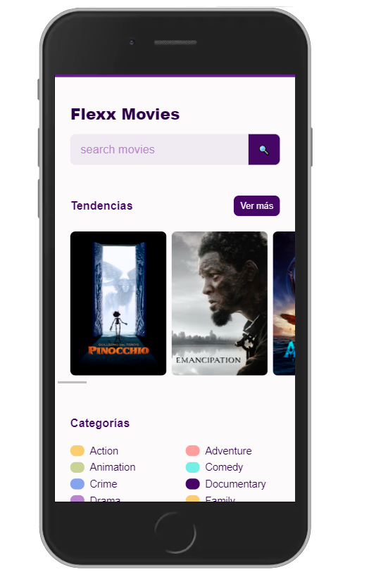
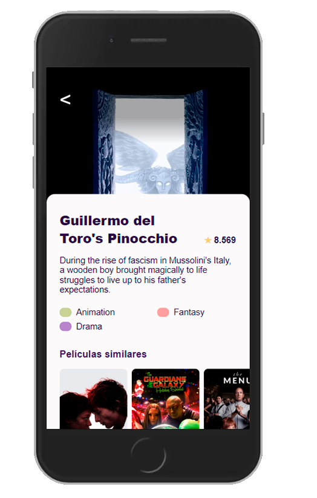
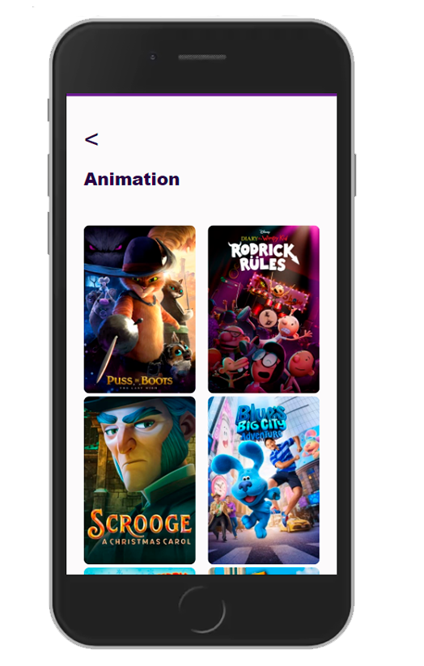

# Flexx The Movies App 📽 🍿

Flexx Movies App, es una SPA para poder obtener informacion de las peliculas en tendecia, 
⚠ solo esta para vista Mobile.


Recursos :

- [TheMovieDB.V3](https://www.themoviedb.org/)

- [API_KEY](https://www.themoviedb.org/settings/api)

- [Figma Project UI/UX](https://www.figma.com/file/AYlJHq4RwChusnwFzMSOjd/Platzi_Movies?node-id=0%3A1)

## View project 🚀🙋🏻‍♂️
## [Deploy](https://flexxn1.github.io/Flexx-Movies-App/)

## Preview Mobile 📲

<p align="center">
  
  
  

</p>

## Installation ⚖
Flexx The Movie App:
```
git clone https://github.com/FlexxN1/Flexx-Movies-App.git
 ```

## License 🔐

Copyright © 2022 [Juan David Moreno](https://github.com/FlexxN1)

This project is [MIT](https://choosealicense.com/licenses/mit/) licensed
